<p align="center">
  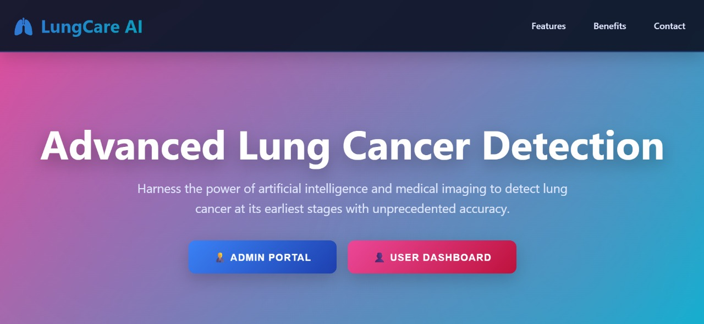
   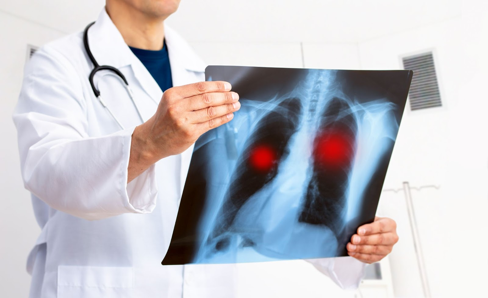
</p>

# 🫁 Lung Cancer Detection Using CT Image Processing & Machine Learning

Welcome to my **Lung Cancer Detection System** 🚑  
This project uses **CT scan image processing** combined with **Machine Learning & Deep Learning models** to detect lung cancer at an early stage.

The system is built with:
- 🧠 **3 ML/DL Models**: CNN, ResNet, Naive Bayes  
- 📊 **Interactive Dashboard** for visualization  
- 🖼️ Advanced CT image preprocessing  
- 🌐 Frontend + Backend integration  

This is a **major/final-year project**, designed with real-world medical AI workflow in mind.

---

## 🎯 Project Objective

The primary objective of this project is to:
- Automatically analyze lung CT scan images  
- Classify them as **Normal / Cancerous**  
- Compare multiple ML & DL models for accuracy  
- Provide results through an **interactive dashboard**

🩺 Early lung cancer detection can significantly improve survival rates, and this project demonstrates how **AI + image processing** can support medical diagnosis.

---

## 🧠 Models Used (Very Important ⭐)

This project uses **three different models** to compare performance:

| Model | Type | Purpose |
|-----|------|--------|
| 🧠 CNN | Deep Learning | Feature extraction directly from CT images |
| 🔥 ResNet | Deep Learning | High-accuracy deep residual learning |
| 📊 Naive Bayes (NB) | Machine Learning | Statistical baseline model |

➡️ Final predictions are analyzed and compared using accuracy, loss, and output confidence.

---

## 🛠️ Technologies & Tools

| Technology | Usage |
|-----------|------|
| 🐍 Python | Core programming |
| 🖼️ OpenCV | CT image preprocessing |
| 🤖 TensorFlow / Keras | CNN & ResNet models |
| 📊 Scikit-learn | Naive Bayes model |
| 🔢 NumPy & Pandas | Data handling |
| 🌐 HTML, CSS, JS | Frontend UI |
| 📊 Dashboard | Visualization & results |
| 📁 Dataset | Lung CT scan images |

---

## ⭐ Key Features

✔ CT image preprocessing (noise removal, resizing, normalization)  
✔ Multi-model comparison (CNN vs ResNet vs NB)  
✔ Accuracy & prediction visualization  
✔ Interactive dashboard  
✔ Frontend image upload support  
✔ Research-grade documentation & reports  

---

## 📁 Complete Project Structure

```text
Lung-Cancer-Detection-Using-CT-ImageProcessing---MachineLearning/
│
├── Dashboards/
│   ├── Admin_Dashboard.html
│   ├── Model_Dashboard.html
│   ├── User_Dashboard.html
│   ├── CT-Lung-Cancer-Photo.jpg
│   ├── CT-Scan-Image.jpg
│   ├── CT-Scan-Image2.jpg
│   └── Cancer1.jpg
│
├── lung-backend/
│   ├── app.py
│   ├── model_cnn.py
│   ├── model_resnet.py
│   ├── model_naive_bayes.py
│   ├── requirements.txt
│   └── utils/
│
├── lung-frontend/
│   ├── index.html
│   ├── style.css
│   ├── script.js
│   └── assets/
│
├── dataset/
│   ├── Normal/
│   └── Cancer/
│
├── notebooks/
│   ├── CNN_Model.ipynb
│   ├── ResNet_Model.ipynb
│   └── NaiveBayes_Model.ipynb
│
├── README.md
└── .gitignore

```

---

## 📸 Project Outputs

<p align="center">
  
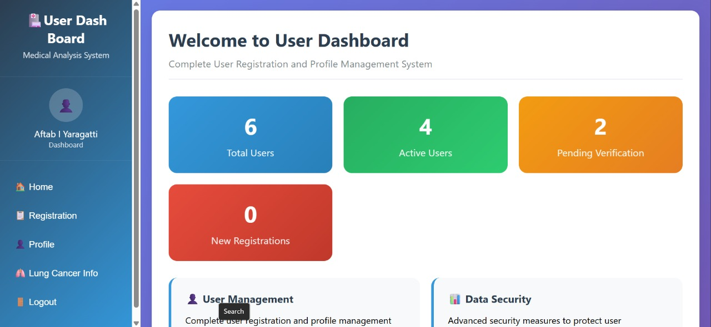
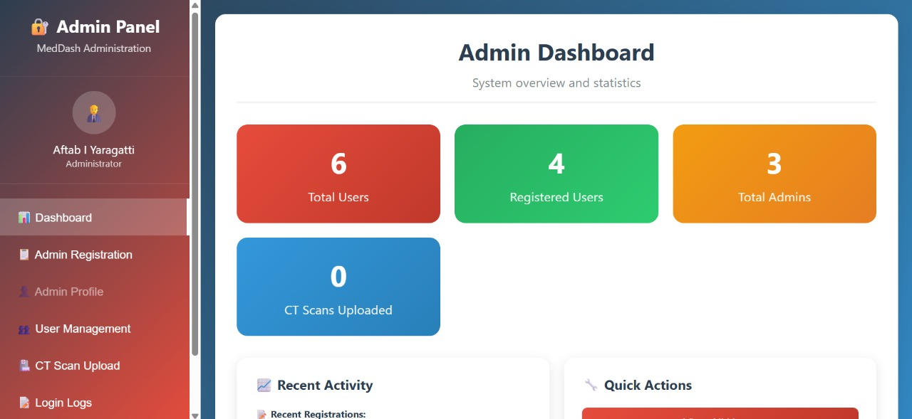
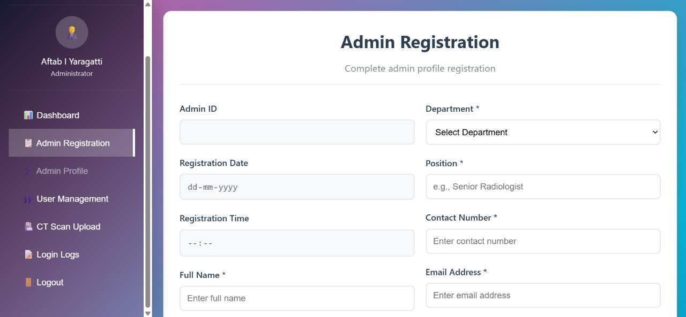
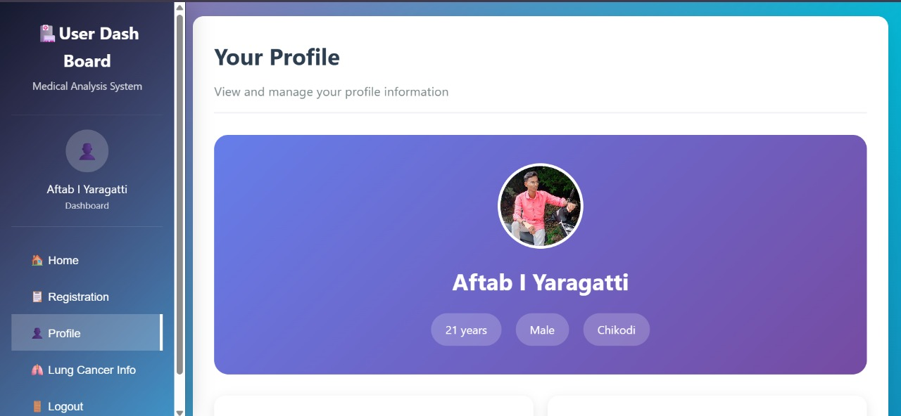

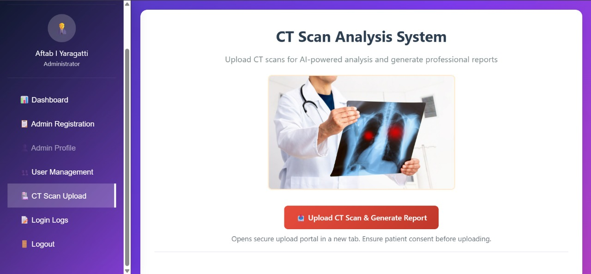
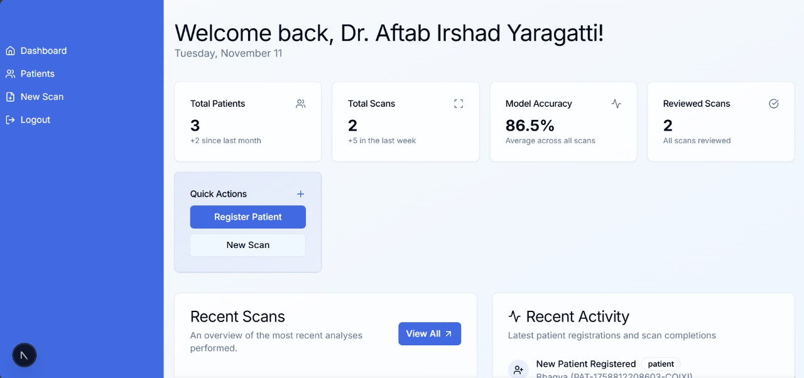
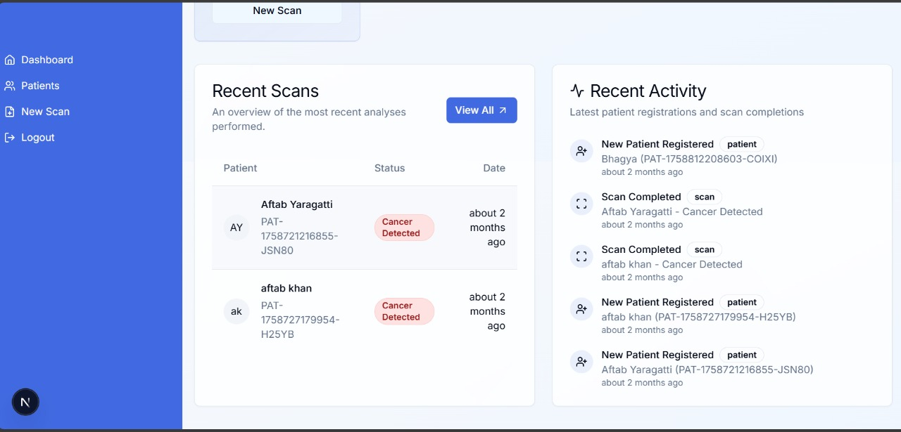
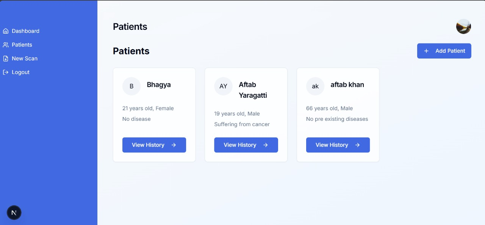
</p>

### 🫁 Select Patient

<p align="center">
  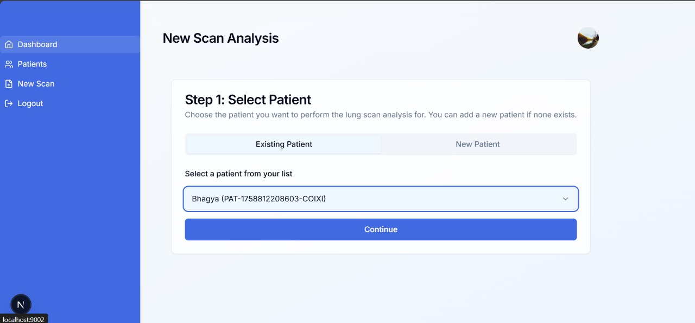
</p>

### 🔍 Upload CT Scan

<p align="center">
  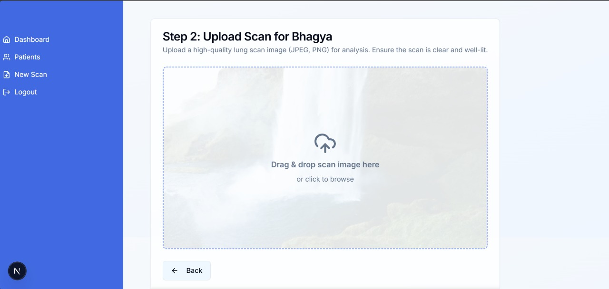
</p>

### 🔍 Choose CT Scan Model

<p align="center">
  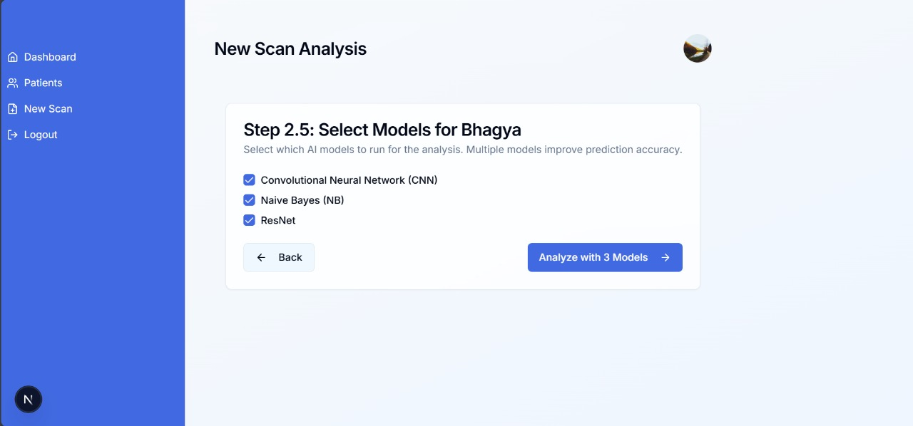
</p>

### 🧠 Prediction Results

<p align="center">
  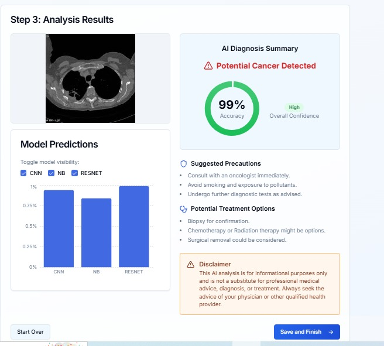
</p>

## 📌 How It Works (High-Level)

<p align="center">
  <a href="Lung_cancer_Detection_Demo_Video.mp4">
    
  </a>
</p>

### 1. **Image Preprocessing**
- Resize CT images  
- Convert to grayscale  
- Apply noise reduction & segmentation  
- Extract features for classification

---

### 2. **Machine Learning Classification**
- Split dataset into train/test sets  
- Train model using ML / deep learning frameworks  
- Evaluate performance (accuracy, confusion matrix, etc.)

Typical classification models include:
- Support Vector Machine (SVM)
- Random Forest
- Convolutional Neural Network (CNN) models (if deep learning used)

---

### 3. **Frontend + Backend Integration**
- User uploads CT image via frontend
- Backend receives and preprocesses
- Model predicts category: **normal or cancerous**
- Result shown instantly on UI

---

## 📜 Deliverables Included

| Artifact | Description |
|----------|-------------|
| 📄 IEEE-Paper | Published paper on the approach |
| 📘 Project Report | Detailed documentation |
| 📊 Output Screenshots | Screenshot bundle of outputs |
| 📽️ PPT | Presentation slides |
| 📜 Source Code PDF | All code documented |

---

## 🧪 How to Use Locally

1. **Clone the repository**

```bash
git clone https://github.com/AftabYaragatti/Lung-Cancer-Detection-Using-CT-ImageProcessing---MachineLearning.git
```

2. **Install dependencies**

```bash
cd lung-backend
pip install -r requirements.txt
```

3. **Run backend API**

```bash
python app.py
```

4. **Open frontend UI**

Open `lung-frontend/index.html` in your browser

---

## 📈 Who This Project Is For

- 🧑‍🎓 Final year students
- 🤖 ML & AI enthusiasts
- 🩺 Healthcare tech researchers
- 💼 Recruiters reviewing data science portfolios

---

## ⚠️ Disclaimer

This project is **for educational and research purposes only**.  
It is *not a medical diagnosis system* and should not be used for clinical decisions.

---

## 👨‍💻 About Me

**Aftab Yaragatti**  
Frontend Developer | Python Programmer | Data Analyst  

🔗 GitHub: https://github.com/AftabYaragatti  
🔗 Portfolio: https://aftabyaragatti.github.io/Portfolio/  
🔗 LinkedIn: https://www.linkedin.com/in/aftab-yaragatti  

---

⭐ If you find this project meaningful, giving it a **star ⭐** encourages more quality work!


